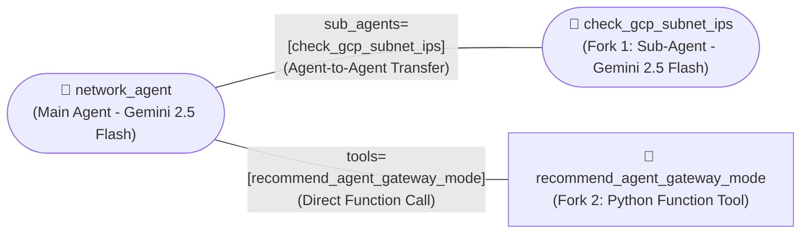

# Simple Agent 02 (`network_agent` + `check_gcp_subnet_ips` Sub-Agent) — Multi-Agent Lab

An evolution of [`simple-agent-01`](https://github.com/indrapn00/simple-agent-01) built with the **Google Agent Development Kit (ADK)** to study how **Multi-Agent Delegation (`sub_agents`)** differs from **Function Tool Calls (`tools`)** in Google Cloud (`gcp-demo-02-307713`, region `asia-southeast2`).

---

## 1. What Changed from `simple-agent-01` to `simple-agent-02`?

In `simple-agent-01`, `network_agent` was a **Single Agent** with 2 Python functions (`🔧 check_gcp_subnet_ips` and `🔧 recommend_agent_gateway_mode`).

In **`simple-agent-02`**, we now have **2 Agents** and **1 Function**:
1. **Main Agent (`🤖 network_agent`):** The orchestrator agent (`root_agent`).
2. **Fork 1 — Formed as a Second Agent (`🤖 check_gcp_subnet_ips`):**
   - Defined as `check_gcp_subnet_ips = Agent(model="gemini-2.5-flash", name="check_gcp_subnet_ips", ...)` and attached to `network_agent` via `sub_agents=[check_gcp_subnet_ips]`.
   - In the ADK visual graph, it renders as a **rounded ellipse with a Robot icon (`🤖 check_gcp_subnet_ips`)**.
   - When you ask a subnet question, `network_agent` calls ADK's built-in `transfer_to_agent(agent_name='check_gcp_subnet_ips')` to hand control over to the `check_gcp_subnet_ips` Agent.
3. **Fork 2 — Kept as a Function (`🔧 recommend_agent_gateway_mode`):**
   - Defined as `def recommend_agent_gateway_mode(traffic_pattern: str) -> dict:` and attached to `network_agent` via `tools=[recommend_agent_gateway_mode]`.
   - In the ADK visual graph, it renders as a **rectangle box with a Wrench icon (`🔧 recommend_agent_gateway_mode`)**.



---

## 2. Code Structure (`network_agent/`)

| File | Purpose |
| :--- | :--- |
| [`network_agent/__init__.py`](./network_agent/__init__.py) | Package entrypoint (`from . import agent`). |
| [`network_agent/agent.py`](./network_agent/agent.py) | Defines the Sub-Agent `check_gcp_subnet_ips` (`🤖`), the function `recommend_agent_gateway_mode` (`🔧`), and the Main Agent `root_agent` (`🤖 network_agent`). |
| [`network_agent/requirements.txt`](./network_agent/requirements.txt) | Lists required packages (`google-adk[a2a]` and `google-cloud-aiplatform[agent_engines]`). |

---

## 3. Deploying `simple-agent-02` in `asia-southeast2`

### Option A: Deploy to Cloud Run (with Web UI + A2A Protocol)
```bash
adk deploy cloud_run \
  --project=gcp-demo-02-307713 \
  --region=asia-southeast2 \
  --service_name=simple-agent-02 \
  --with_ui \
  --a2a \
  ./network_agent \
  -- --allow-unauthenticated
```

### Option B: Deploy to Agent Platform (Vertex AI Agent Engine)
```bash
adk deploy agent_engine \
  --project=gcp-demo-02-307713 \
  --region=asia-southeast2 \
  --display_name="simple-agent-02" \
  --description="2-Agent Architecture: network_agent + check_gcp_subnet_ips Sub-Agent" \
  ./network_agent
```

---

## 4. How to Test Both Forks (Agent Delegation vs. Function Call)

1. **Test Fork 1 (Agent-to-Agent Delegation to `🤖 check_gcp_subnet_ips`):**
   - **Prompt:** `"How many usable IPs are in 10.20.0.0/28 in GCP?"`
   - **What happens in the trace:** `network_agent` invokes `transfer_to_agent(agent_name="check_gcp_subnet_ips")`, and the **`check_gcp_subnet_ips` Agent** (`author: "check_gcp_subnet_ips"`) generates the response!
2. **Test Fork 2 (Function Call to `🔧 recommend_agent_gateway_mode`):**
   - **Prompt:** `"We have an existing Application Load Balancer (ALB). Which Agent Gateway mode should we use?"`
   - **What happens in the trace:** `network_agent` calls `recommend_agent_gateway_mode(traffic_pattern="existing ALB")` and answers directly (`author: "network_agent"`).
