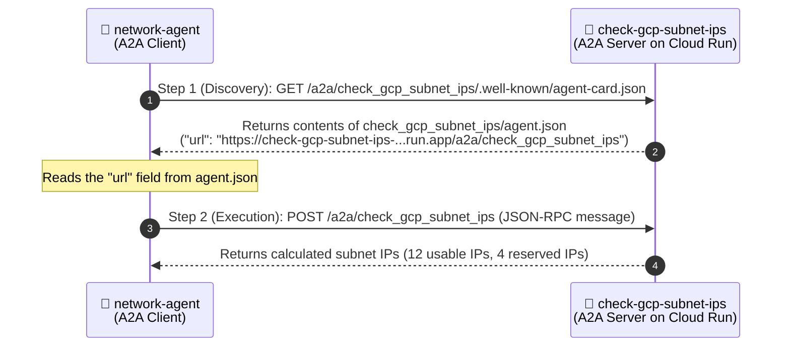

# Google Cloud Multi-Agent Deployment & A2A Connectivity — Study Notes (`simple-agent-02`)

> **Author / Context:** Study notes for a Google Cloud CE Networking Specialist (`indrapn`) learning how **distributed multi-agent systems** are architected, deployed as separate services on **Cloud Run** and **Agent Platform (Vertex AI Agent Engine)** in `asia-southeast2`, connected via the **Agent-to-Agent (A2A)** protocol or Vertex AI Regional APIs, and prepared for **Agent Gateway** governance.

---

## 1. Evolution: From `simple-agent-01` to `simple-agent-02`

### 1.1 Single Agent vs. In-Process Sub-Agent vs. Two Separate Deployed Agents

When moving from a single agent (`simple-agent-01`) to a multi-agent architecture (`simple-agent-02`), there is an important distinction between **logical sub-agents in code** and **physically separate deployed agents**:

| Architecture Pattern | What Happens in GCP Console | Network Traffic Between Agents? | Good For Studying Agent Gateway? |
| :--- | :--- | :--- | :--- |
| **1. Single Agent with 2 Functions** (`simple-agent-01`) | Shows **1 deployed agent** (`simple-agent-01`). Both forks are plain Python functions (`🔧`). | **No** (in-memory Python function calls). | Baseline only. |
| **2. Single Deployment with In-Process `sub_agents`** | Still shows **only 1 big deployed agent**! Even though Fork 1 is an `Agent` (`🤖`) in Python, both agents live inside the **exact same container**. | **No** (in-memory handoff inside one container). | **No** — an external gateway cannot see traffic that stays inside a single container. |
| **3. Two Separate Deployed Agents** (`simple-agent-02` final architecture) | Shows **2 separate deployed agents** in Cloud Run and Agent Platform:<br>1. **`network-agent`** (Main Agent)<br>2. **`check-gcp-subnet-ips`** (Specialist Agent) | **Yes!** Every time `network-agent` delegates to `check-gcp-subnet-ips`, a **real network call** crosses between the two services. | **Yes!** This creates real east-west **Agent-to-Agent (A2A)** network traffic. |

---

### 1.2 What lives inside each of our 2 Separate Agents?

```text
simple-agent-02/
├── check_gcp_subnet_ips/        # DEPLOYED AGENT 1: Standalone Subnet Specialist Agent
│   ├── __init__.py
│   ├── agent.py                 # Defines `check_gcp_subnet_ips` Agent (🤖) + `calculate_subnet_ips` tool (🔧)
│   ├── agent.json               # A2A Agent Card (Business Card for Cloud Run A2A discovery)
│   └── requirements.txt
└── network_agent/               # DEPLOYED AGENT 2: Main Orchestrator Agent
    ├── __init__.py
    ├── agent.py                 # Defines `network_agent` (🤖):
    │                            #   - Fork 1: Calls remote `check-gcp-subnet-ips` Agent over the network (🤖)
    │                            #   - Fork 2: Calls local `recommend_agent_gateway_mode` function (🔧)
    ├── agent.json               # A2A Agent Card for `network-agent`
    └── requirements.txt
```

---

## 2. The 3 Multi-Agent Deployment & Connectivity Modes

In [`network_agent/agent.py`](./network_agent/agent.py), `network-agent` can connect to the separately deployed `check-gcp-subnet-ips` agent in **3 different ways**, controlled by `SUBNET_AGENT_TARGET`:

```mermaid
flowchart TB
    subgraph Mode1["Mode 1: Native Cloud Run Only (SUBNET_AGENT_TARGET=cloud_run)"]
        CR_Main["🤖 network-agent<br/>(Cloud Run)"] -->|"A2A Protocol (HTTPS JSON-RPC)<br/>RemoteA2aAgent"| CR_Sub["🤖 check-gcp-subnet-ips<br/>(Cloud Run)"]
    end

    subgraph Mode2["Mode 2: Native Agent Platform Only (SUBNET_AGENT_TARGET=agent_platform)"]
        AE_Main["🤖 network-agent<br/>(Agent Platform / Engine)"] -->|"Vertex AI Regional API (IAM)<br/>RemoteAgentEngineSubAgent"| AE_Sub["🤖 check-gcp-subnet-ips<br/>(Agent Platform / Engine)"]
    end

    subgraph Mode3["Mode 3: Hybrid Cloud Run to Agent Platform (SUBNET_AGENT_TARGET=agent_platform)"]
        HY_Main["🤖 network-agent<br/>(Cloud Run)"] -->|"Vertex AI Regional API (IAM)<br/>Compute SA -> ReasoningEngine"| HY_Sub["🤖 check-gcp-subnet-ips<br/>(Agent Platform / Engine)"]
    end
```



### 2.1 Comparison of the 3 Modes

| Feature | Mode 1: Native Cloud Run Only<br>*(Cloud Run $\rightarrow$ Cloud Run)* | Mode 2: Native Agent Platform Only<br>*(Agent Platform $\rightarrow$ Agent Platform)* | Mode 3: Hybrid<br>*(Cloud Run $\rightarrow$ Agent Platform)* |
| :--- | :--- | :--- | :--- |
| **Where `network-agent` runs** | **Cloud Run** (`asia-southeast2`) | **Agent Platform** (`asia-southeast2`) | **Cloud Run** (`asia-southeast2`) |
| **Where `check-gcp-subnet-ips` runs** | **Cloud Run** (`asia-southeast2`) | **Agent Platform** (`asia-southeast2`) | **Agent Platform** (`asia-southeast2`) |
| **Does it depend on Cloud Run?** | Yes (100% Cloud Run) | **No! Zero Cloud Run dependency.** You can delete all Cloud Run services and Mode 2 keeps working. | Only for `network-agent` (the frontend UI); `check-gcp-subnet-ips` runs on Agent Platform only. |
| **Target Identifier Used by `network-agent`** | **Cloud Run HTTPS URL:**<br>`https://check-gcp-subnet-ips-...run.app` | **Agent Engine Resource ID:**<br>`projects/66063681189/locations/asia-southeast2/reasoningEngines/<ID>` | **Agent Engine Resource ID:**<br>`projects/66063681189/locations/asia-southeast2/reasoningEngines/<ID>` |
| **Protocol Used on the Wire** | **A2A Protocol** (`GET /.well-known/agent-card.json` + `POST /a2a/check_gcp_subnet_ips`) | **Vertex AI Regional API** (`asia-southeast2-aiplatform.googleapis.com/...:streamQuery`) | **Vertex AI Regional API** (`asia-southeast2-aiplatform.googleapis.com/...:streamQuery`) |
| **How Authentication Works** | HTTPS (Public `--allow-unauthenticated` or Cloud Run IAM Invoker) | Automatic GCP IAM via Reasoning Engine Service Agent | Automatic GCP IAM via Cloud Run's Compute Service Account (`66063681189-compute@...`) |

---

## 3. Key Questions & Architectural Insights (Q&A Summary)

### Q1: Must I always deploy `check-gcp-subnet-ips` first and `network-agent` second?
**No! You can deploy `network-agent` first and `check-gcp-subnet-ips` second.**

- **Why Top-Down (`network-agent` first) works:**
  Both `RemoteA2aAgent` (Mode 1) and `RemoteAgentEngineSubAgent` (Mode 2/3) use **lazy connection resolution**.
  - When `network-agent` deploys and starts up, it **only saves the target URL or Agent Engine ID string in memory**. It does **not** ping `check-gcp-subnet-ips` during deployment or boot.
  - It only opens a network connection at the exact moment a user asks a subnet question.
- **Networking Analogy:**
  Configuring `RemoteA2aAgent` in `network-agent` is like adding a **static route** (`ip route 10.10.0.0/28 next-hop <peer>`) on a router:
  - You can configure the route before the next-hop router (`check-gcp-subnet-ips`) is powered on.
  - Local traffic (**Fork 2:** `recommend_agent_gateway_mode`) works immediately.
  - As soon as `check-gcp-subnet-ips` finishes deploying a minute later, **Fork 1** automatically starts working without needing to restart `network-agent`!
- **Why Bottom-Up (`check-gcp-subnet-ips` first) is often convenient:**
  1. If you are deploying to **Agent Platform (Mode 2/3)**, Google Cloud assigns a brand-new numeric `reasoningEngines/<ID>` when `check-gcp-subnet-ips` is created. Deploying `check-gcp-subnet-ips` first gives you that ID so you can paste it into `network_agent/agent.py`.
  2. It avoids any brief "blackhole" window while the second agent is still deploying.

---

### Q2: What is `agent.json` used for, and why did it have a Cloud Run URL?
**`agent.json` is the "A2A Agent Card" (a machine-readable business card / service discovery document) used ONLY for A2A over HTTP (Mode 1: Cloud Run).**

When `network-agent` calls `check-gcp-subnet-ips` on Cloud Run via `RemoteA2aAgent`, a **2-step handshake** happens over HTTPS:



- **Why [`check_gcp_subnet_ips/agent.json`](./check_gcp_subnet_ips/agent.json) matters in Mode 1:**
  In Step 2, `network-agent` sends the `POST` request to whatever `"url"` is written inside [`check_gcp_subnet_ips/agent.json`](./check_gcp_subnet_ips/agent.json).
- **What about [`network_agent/agent.json`](./network_agent/agent.json)?**
  Your browser does **not** use `network_agent/agent.json` when you open the Web UI. It is only used if another upstream agent or **Agent Gateway** calls `network-agent` via the A2A protocol.
- **Does Agent Platform (Mode 2 & Mode 3) use `agent.json`?**
  **No!** Agent Platform ignores `agent.json` completely because it routes traffic using the **Reasoning Engine ID** (`reasoningEngines/<ID>`).

---

### Q3: Doesn't putting the Cloud Run URL inside `agent.json` create a "Chicken-and-Egg" problem when deploying from scratch?
**Yes — and there are 2 ways to solve it:**

1. **Solution 1: Use Cloud Run's Predictable URL Formula (Before Deploying)**
   Modern Google Cloud Run URLs are **100% deterministic** and follow this exact formula:
   ```text
   https://<SERVICE_NAME>-<PROJECT_NUMBER>.<REGION>.run.app
   ```
   For example, in project `gcp-demo-02-307713` (Project Number `66063681189`) in region `asia-southeast2`, a service named `check-gcp-subnet-ips` will **always** get the URL:
   ```text
   https://check-gcp-subnet-ips-66063681189.asia-southeast2.run.app
   ```
   Because you know your `<SERVICE_NAME>`, `<PROJECT_NUMBER>`, and `<REGION>` before deploying, you can fill in the URL before your very first deployment!

2. **Solution 2: The "Two-Pass" Deployment (If you don't know the URL ahead of time)**
   - **Pass 1:** Deploy `check-gcp-subnet-ips` even with a placeholder in `agent.json`. **The deployment will still succeed** (ADK only checks that `agent.json` is valid JSON; it does not ping the URL at boot). Cloud Run will print the newly assigned `Service URL`.
   - **Pass 2:** Copy that printed URL into `check_gcp_subnet_ips/agent.json` and re-run `adk deploy cloud_run` so it advertises the real URL.

---

### Q4: If `network-agent` is deployed 100% on Agent Platform (Mode 2, no Cloud Run UI), how do I access it?
Unlike Cloud Run (which runs a web server on `*.run.app`), **Agent Platform (Vertex AI Agent Engine)** is a managed backend runtime behind `aiplatform.googleapis.com`. You can access it in **4 ways**:

1. **Google Cloud Console Built-in "Playground" UI (Zero-Code Browser UI):**
   - Go to **Google Cloud Console** $\rightarrow$ **Vertex AI** $\rightarrow$ **Agent Engine** $\rightarrow$ select Region **`asia-southeast2 (Jakarta)`** $\rightarrow$ click **`network-agent`** $\rightarrow$ click the **Playground** tab.
   - Direct link: **[Open `network-agent` Playground (`5881665928973778944`)](https://console.cloud.google.com/vertex-ai/agents/agent-engines/locations/asia-southeast2/agent-engines/5881665928973778944/playground?project=66063681189)**
2. **REST API (`curl` with IAM Token):**
   ```bash
   curl -s -X POST \
     -H "Authorization: Bearer $(gcloud auth print-access-token)" \
     -H "Content-Type: application/json" \
     "https://asia-southeast2-aiplatform.googleapis.com/v1/projects/gcp-demo-02-307713/locations/asia-southeast2/reasoningEngines/5881665928973778944:streamQuery" \
     -d '{
       "class_method": "stream_query",
       "input": {
         "user_id": "indra",
         "message": "How many usable IPs are in 10.10.0.0/28 in GCP?"
       }
     }'
   ```
3. **Python SDK (`vertexai.agent_engines`):**
   ```python
   import vertexai
   from vertexai import agent_engines

   vertexai.init(project="gcp-demo-02-307713", location="asia-southeast2")
   remote_network_agent = agent_engines.get(
       "projects/66063681189/locations/asia-southeast2/reasoningEngines/5881665928973778944"
   )
   for event in remote_network_agent.stream_query(
       user_id="indra",
       message="How many usable IPs are in 10.10.0.0/28 in GCP?",
   ):
       print(event)
   ```
4. **Gemini Enterprise (formerly Vertex AI Agentspace) UI:**
   - For production business users, you link the Reasoning Engine ID into **Gemini Enterprise** to give employees a web chat portal.

---

## 4. Quick Checklist: What to Replace When Re-Deploying From Scratch

All static URLs and IDs in the code have been replaced with `<REPLACE_WITH_...>` placeholders so you never get confused by stale addresses if you delete and recreate your deployments:

| Mode You Want to Deploy | Files / Env Vars You Need to Update |
| :--- | :--- |
| **Mode 1: Native Cloud Run Only**<br>*(Cloud Run $\rightarrow$ Cloud Run)* | 1. In [`check_gcp_subnet_ips/agent.json`](./check_gcp_subnet_ips/agent.json): Replace `https://<REPLACE_WITH_CHECK_GCP_SUBNET_IPS_CLOUD_RUN_URL>`<br>2. In [`network_agent/agent.py`](./network_agent/agent.py) *(or via Cloud Run env var `CHECK_GCP_SUBNET_IPS_BASE_URL`)*: Set your `check-gcp-subnet-ips` Cloud Run URL and `SUBNET_AGENT_TARGET="cloud_run"`. |
| **Mode 2: Native Agent Platform Only**<br>*(Agent Platform $\rightarrow$ Agent Platform)* | 1. Deploy `check-gcp-subnet-ips` to Agent Platform first and copy its new `reasoningEngines/<ID>`.<br>2. In [`network_agent/agent.py`](./network_agent/agent.py): Replace `<REPLACE_WITH_CHECK_GCP_SUBNET_IPS_AGENT_ENGINE_ID>` with that ID, then deploy `network-agent` to Agent Platform.<br>*(You do **not** need to touch `agent.json` at all!)* |
| **Mode 3: Hybrid**<br>*(Cloud Run `network-agent` $\rightarrow$ Agent Platform `check-gcp-subnet-ips`)* | Run `gcloud run services update network-agent` with:<br>`SUBNET_AGENT_TARGET=agent_platform`<br>`CHECK_GCP_SUBNET_IPS_AGENT_ENGINE_ID=projects/66063681189/locations/asia-southeast2/reasoningEngines/<ID>` |

---

## 5. Current Live Resource Reference (`asia-southeast2`)

| Agent | Platform | Live URL / Resource Name |
| :--- | :--- | :--- |
| **`network-agent`** (Main Agent) | **Cloud Run** | `https://network-agent-66063681189.asia-southeast2.run.app` |
| **`check-gcp-subnet-ips`** (Subnet Agent) | **Cloud Run** | `https://check-gcp-subnet-ips-66063681189.asia-southeast2.run.app` |
| **`network-agent`** (Main Agent) | **Agent Platform** | `projects/66063681189/locations/asia-southeast2/reasoningEngines/5881665928973778944` |
| **`check-gcp-subnet-ips`** (Subnet Agent) | **Agent Platform** | `projects/66063681189/locations/asia-southeast2/reasoningEngines/2395879817389015040` |

---

## 6. Troubleshooting Case Study: `HTTP 404 Not Found` on `/.well-known/agent-card.json`

### 6.1 The Symptom
You deployed both `check-gcp-subnet-ips` and `network-agent` to Cloud Run with `--a2a`, and configured `agent.json` and `agent.py` with the right Cloud Run URLs. Both services show a green checkmark (`✔`) in Cloud Run and their Web UIs load fine.
However, when `network-agent` tries to call `check-gcp-subnet-ips`, it fails with:
```text
Failed to initialize remote A2A agent check_gcp_subnet_ips:
Failed to resolve AgentCard from URL https://check-gcp-subnet-ips-66063681189.asia-southeast2.run.app/a2a/check_gcp_subnet_ips/.well-known/agent-card.json (HTTP 404)
```

### 6.2 How to Diagnose It Like a Network Engineer
1. **Test the A2A Discovery Endpoint Directly (`curl`):**
   ```bash
   curl -i "https://check-gcp-subnet-ips-66063681189.asia-southeast2.run.app/a2a/check_gcp_subnet_ips/.well-known/agent-card.json"
   ```
   Seeing `404 Not Found` while `/` returns `200 OK` means the container is up, **but FastAPI failed to mount the `/a2a/check_gcp_subnet_ips` route during startup**.

2. **Check Cloud Run Startup Logs for `"Failed to setup A2A agent"`:**
   In ADK (`google/adk/cli/fast_api.py`), if mounting the A2A route throws an exception during boot, ADK catches the exception, logs `ERROR - Failed to setup A2A agent ...`, and **continues starting the web server anyway**.
   Run:
   ```bash
   gcloud logging read 'resource.type="cloud_run_revision" AND resource.labels.service_name="check-gcp-subnet-ips" AND textPayload:"A2A"' \
     --project=gcp-demo-02-307713 \
     --limit=20 \
     --format="value(timestamp,textPayload)"
   ```

3. **The Exact Error Found in the Logs:**
   ```text
   ERROR - fast_api.py:742 - Failed to setup A2A agent check_gcp_subnet_ips: No module named 'sse_starlette'
   ```

### 6.3 Why It Happened & The Permanent Fix
- **Root Cause:** The terminal/Cloud Shell used to run `adk deploy cloud_run` had **`google-adk==2.6.2`** installed. When `adk deploy cloud_run` generated the `Dockerfile`, it ran `pip install "google-adk[a2a]==2.6.2"`, which installs `a2a-sdk` **without** its HTTP server dependency `sse-starlette` (`a2a-sdk[http-server]`).
- **Permanent Fix:** Add `a2a-sdk[http-server]` and `sse-starlette` explicitly to both [`check_gcp_subnet_ips/requirements.txt`](./check_gcp_subnet_ips/requirements.txt) and [`network_agent/requirements.txt`](./network_agent/requirements.txt):
  ```text
  google-cloud-aiplatform[agent_engines]
  google-adk[a2a]
  a2a-sdk[http-server]
  sse-starlette
  ```

